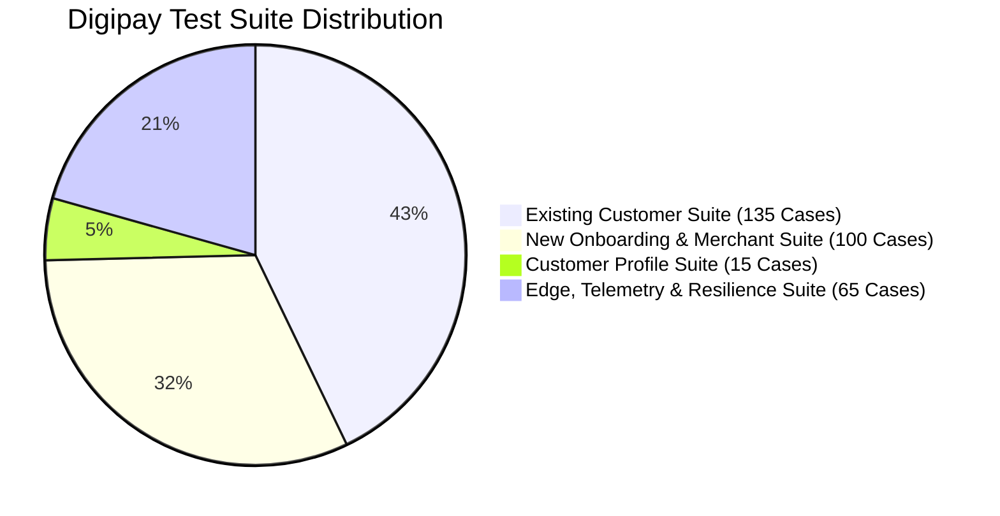

# Digipay iOS App: Complete 315+ Test Cases Suite & Workflows Plan

This document outlines the testing strategy for hardware capabilities (Location and Camera/QR) on the iOS simulator, logs the accessibility identifiers mapping, and compiles the complete catalog of **315 test cases** to ensure full coverage of customer and merchant workflows.

---

## 🛠️ Part 1: Simulator Hardware Mocking Guide

### 1. Geolocation Mocking (Location Screen)
Since the `MerchantLocationView` captures latitude, longitude, altitude, accuracy, heading, and speed, we mock these in the automated Appium suite using Appium's geolocation injection:
```typescript
// Appium WebDriverIO Example
await driver.setGeoLocation({
  latitude: 12.9715987,
  longitude: 77.5945627,
  altitude: 920.0
});
```
Or via the simulator CLI command during local execution:
```bash
xcrun simctl location booted set 12.9715987 77.5945627
```

### 2. Camera / QR Code Mocking (UPI Scan Screen)
Rather than trying to inject a live video stream into the simulator camera, we leverage the developer-defined mock hook inside `MerchantUPIScanView.swift`:
- Under simulator builds (`#if targetEnvironment(simulator)`), an orange button **"Mock Scan QR (Simulator)"** renders.
- The test script will simply locate `.accessibilityIdentifier("mockScanQrButton")` and click it.
- This programmatically sets `scannedCode = "upi://pay?pa=merchant@upi&pn=SupreethStore&am=0.00"`, simulating a successful QR scan instantly.
- In manual or fallback testing, if camera permissions are denied, the test types the UPI ID manually into the text field.

---

## 🏷️ Part 2: Accessibility Identifiers Mapping

To ensure Appium can interact with the elements, the following attributes must be present. We will add them locally for verification:

| Screen File | Element Description | Proposed Accessibility Identifier |
| :--- | :--- | :--- |
| **MerchantLocationView.swift** | Continue button | `continueLocationButton` |
| **MerchantLocationView.swift** | Detecting spinner | `locationStatusSpinner` |
| **MerchantLocationView.swift** | Altitude value chip | `altitudeChip` |
| **MerchantLocationView.swift** | Accuracy value chip | `accuracyChip` |
| **MerchantLocationView.swift** | Heading value chip | `headingChip` |
| **MerchantLocationView.swift** | Speed value chip | `speedChip` |
| **MerchantUPIScanView.swift** | "Open Scanner" button | `openScannerButton` |
| **MerchantUPIScanView.swift** | "Complete Registration" button | `completeMerchantRegistrationButton` |
| **MerchantHomeView.swift** | Pencil icon (Edit profile Link) | `editMerchantProfileButton` |
| **MerchantHomeView.swift** | Logout button | `merchantLogoutButton` |
| **MerchantHomeView.swift** | "View Statement" link | `viewStatementButton` |
| **EditMerchantProfileView.swift** | Custom back button | `editProfileBackButton` |
| **EditMerchantProfileView.swift** | Business Name TextField | `editMerchantBusinessNameInput` |
| **EditMerchantProfileView.swift** | Owner Name TextField | `editMerchantOwnerNameInput` |
| **EditMerchantProfileView.swift** | GST Number TextField | `editMerchantGstInput` |
| **EditMerchantProfileView.swift** | Description TextEditor | `editMerchantDescriptionInput` |
| **EditMerchantProfileView.swift** | Latitude TextField | `editMerchantLatitudeInput` |
| **EditMerchantProfileView.swift** | Longitude TextField | `editMerchantLongitudeInput` |
| **EditMerchantProfileView.swift** | UPI Deep Link TextField | `editMerchantUpiInput` |
| **EditMerchantProfileView.swift** | "Refresh Coordinates" button | `refreshCoordinatesButton` |
| **EditMerchantProfileView.swift** | "Scan QR Code" button | `scanQrCodeButton` |
| **EditMerchantProfileView.swift** | "Save Changes" button | `saveChangesButton` |
| **MerchantPaymentsHistoryView.swift** | Back button | `paymentsHistoryBackButton` |
| **MerchantPaymentsHistoryView.swift** | Search bar TextField | `paymentsHistorySearchField` |
| **MerchantPaymentsHistoryView.swift** | Clear search text button | `paymentsHistorySearchClearButton` |

---

## 📊 Part 3: Test Suites Summary (315 Total Cases)



---

## 📂 Section A: Existing Customer Suite (135 Cases Summary)

*These cases are currently implemented in the test files (`test_smoke.ts`, `test_uiux.ts`, `test_accessibility.ts`, `test_regression.ts`, etc.) targeting Customer features.*

- **Smoke Suite (`TC-SMK-001` to `TC-SMK-015`)** [15 cases]: App launch, login visibility, customer dashboard, location sync, budget summary, category chips, logout flow.
- **UI/UX Suite (`TC-UI-001` to `TC-UI-020`)** [20 cases]: Typography, button touch targets, scroll behavior, dynamic island margins, screen transitions.
- **Accessibility Suite (`TC-ACC-001` to `TC-ACC-015`)** [15 cases]: Labels, order, font scaling, contrast, touch target sizes.
- **Navigation Suite (`TC-NAV-001` to `TC-NAV-015`)** [15 cases]: Tab switching, deep links, back arrow stack pops, redirection loops.
- **Functional Suite (`TC-FNC-001` to `TC-FNC-020`)** [20 cases]: Wallet addition, category expense calculation, offline sync, profile editing.
- **Validation Suite (`TC-VAL-001` to `TC-VAL-020`)** [20 cases]: Mobile number rules, OTP boundaries, email validation patterns.
- **Regression Suite (`TC-REG-001` to `TC-REG-015`)** [15 cases]: Wallet stable calculations, category selections, persistent sessions.
- **Performance Suite (`TC-PRF-001` to `TC-PRF-015`)** [15 cases]: Launch time, list scroll latency, network offline load speed.

---

## 📂 Section B: New Onboarding & Merchant Suite (100 Cases)

### 📂 Screen 1: Role Selection Screen (`RoleSelectionView`)
*Tests Role Selection screen flow (10 cases)*

| Test ID | Title | Steps | Expected Outcome |
|---|---|---|---|
| **TC-RLS-001** | Screen Launch | Launch app; verify logo, title, and buttons render. | Role selection elements render clearly. |
| **TC-RLS-002** | Customer Selection | Tap "Customer" button. | Navigates to Customer Login screen. |
| **TC-RLS-003** | Merchant Selection | Tap "Merchant" button. | Navigates to Merchant Login screen. |
| **TC-RLS-004** | Role Badge Highlight | Verify Role selection highlights active state. | Selected role displays correct feedback. |
| **TC-RLS-005** | Accessibility Labels | Verify element accessibility tags. | `roleCustomerButton` / `roleMerchantButton` present. |
| **TC-RLS-006** | App Logo Render | Verify brand logo scales correctly. | Logo renders in correct aspect ratio. |
| **TC-RLS-007** | Subtitle Copy | Verify sub-text explains context-aware payments. | Text layout is clear and correct. |
| **TC-RLS-008** | Screen Transition | Verify transition animation timing. | Transition performs smoothly. |
| **TC-RLS-009** | Safe Area Padding | Verify margins on various devices. | Layout stays within safe margins. |
| **TC-RLS-010** | Device Rotation | Rotate device to landscape. | Layout scales/pads dynamically. |

### 📂 Screen 2: Login & Authentication Screen (`LoginView`)
*Tests Mobile input and validation (10 cases)*

| Test ID | Title | Steps | Expected Outcome |
|---|---|---|---|
| **TC-LGN-001** | UI Layout Verification | Verify +91 prefix, input text field, and submit button. | Elements aligned properly. |
| **TC-LGN-002** | Back Button Navigation | Tap back chevron. | Navigates back to Role Selection. |
| **TC-LGN-003** | Empty Mobile Submit | Click Continue with empty field. | Error displays "Please enter a valid mobile number". |
| **TC-LGN-004** | Short Mobile Submit | Enter 5-digit number and click Continue. | Submission blocks with error styling. |
| **TC-LGN-005** | Alpha/Special Characters | Attempt typing non-numeric inputs. | Non-numeric input is rejected. |
| **TC-LGN-006** | Max Length Enforcement | Enter >10 digits. | Capped at exactly 10 digits. |
| **TC-LGN-007** | Keyboard Type | Tap mobile number field. | `numberPad` keyboard displays. |
| **TC-LGN-008** | Keyboard Done Button | Tap Done button. | Keyboard dismisses cleanly. |
| **TC-LGN-009** | Role Badge Display | Check active role badge card. | Displays selected role (Merchant/Customer). |
| **TC-LGN-010** | Clear Validation on Edit | Trigger error, type new number. | Validation error clears. |

### 📂 Screen 3: OTP Verification Screen (`OTPView`)
*Tests 6-digit verification code input (10 cases)*

| Test ID | Title | Steps | Expected Outcome |
|---|---|---|---|
| **TC-OTP-001** | Screen Presentation | Open OTP screen; verify slots and timer. | Slots and Resend timer render. |
| **TC-OTP-002** | Auto-focus Field | Check initial focus. | Slot 1 is active automatically. |
| **TC-OTP-003** | Numeric Inputs Only | Type alphabet chars. | Alphabet chars are ignored. |
| **TC-OTP-004** | Auto-advance Focus | Type digits sequentially. | Cursor moves to next slot. |
| **TC-OTP-005** | Backspace Behavior | Press backspace in middle slot. | Clears digit and moves focus back. |
| **TC-OTP-006** | Invalid OTP Submit | Enter wrong 6-digit OTP. | Error displays; submission blocked. |
| **TC-OTP-007** | Resend Timer | Check resend countdown. | Counts down 60s; button disabled. |
| **TC-OTP-008** | Resend Action | Click resend at 0s. | Resets timer to 60s. |
| **TC-OTP-009** | Valid Login Completion | Enter correct OTP code. | Dashboard loads successfully. |
| **TC-OTP-010** | Cancel OTP Verification | Tap back chevron. | Login page loads; number cached. |

### 📂 Screen 4: Customer Profile Setup Screen (`ProfileSetupView`)
*Tests first-time Customer onboarding (10 cases)*

| Test ID | Title | Steps | Expected Outcome |
|---|---|---|---|
| **TC-CPS-001** | Onboarding Flow Launch | Log in with new Customer number. | Setup screen displays automatically. |
| **TC-CPS-002** | Submit Blank Name | Click Continue with empty Name. | "Please enter your name" warning displays. |
| **TC-CPS-003** | Optional Email Format | Enter invalid email format (e.g. `test@@com`). | Validation fails; rejects input. |
| **TC-CPS-004** | Valid Registration | Enter Name, valid optional email. | Dashboard opens successfully. |
| **TC-CPS-005** | Button States | Check button with empty Name. | Button is disabled. |
| **TC-CPS-006** | Keyboard Return | Tap keyboard return. | Shifting focus or keyboard dismiss. |
| **TC-CPS-007** | Email Input Type | Tap Email field. | Keyboard with `@` and `.` displays. |
| **TC-CPS-008** | Special Character Names | Type symbols in Name field. | Cleaned up or accepted contextually. |
| **TC-CPS-009** | Loading Indicator | Click Submit; check loader. | Spinner displays while API loads. |
| **TC-CPS-010** | State Persistence | Terminate app mid-setup. | Re-prompts setup on next launch. |

### 📂 Screen 5: Merchant Basic Info Screen (`MerchantBasicInfoView`)
*Tests Step 1 of merchant onboarding (10 cases)*

| Test ID | Title | Steps | Expected Outcome |
|---|---|---|---|
| **TC-MBI-001** | First-Step Layout | Log in as new Merchant; verify step. | Progress bar shows "Step 1 of 3". |
| **TC-MBI-002** | Blank Fields Submit | Tap Continue with empty fields. | Button disabled; validation triggers. |
| **TC-MBI-003** | Category Dropdown | Tap category selector. | Menu of categories renders successfully. |
| **TC-MBI-004** | GSTIN Format | Enter invalid GSTIN format. | Validation rejects non-standard GSTIN. |
| **TC-MBI-005** | Description Limit | Enter >200 chars. | Capped at 200 chars. |
| **TC-MBI-006** | Progress Bar Sync | Verify active steps indicator. | Highlights step 1 active. |
| **TC-MBI-007** | Input Focus Shifts | Type field and press Return. | Shifts focus to next field. |
| **TC-MBI-008** | Valid Input Progress | Fill required fields; click Continue. | Navigates to Location screen (Step 2). |
| **TC-MBI-009** | Character Sanitization | Type SQL/HTML in inputs. | Inputs sanitized. |
| **TC-MBI-010** | Keyboard Dismissal | Tap on background area. | Virtual keyboard dismisses. |

### 📂 Screen 6: Merchant Location Capture Screen (`MerchantLocationView`)
*Tests GPS and location permissions (10 cases)*

| Test ID | Title | Steps | Expected Outcome |
|---|---|---|---|
| **TC-MLC-001** | Prompt Presentation | Open location screen; check indicator. | Progress shows "Step 2 of 3" with spinner. |
| **TC-MLC-002** | Permission Refusal | Deny location permission pop-up. | Warning instructs to enable in Settings. |
| **TC-MLC-003** | Successful GPS Hook | Accept location permission. | Latitude, longitude, altitude resolve. |
| **TC-MLC-004** | Telemetry Validity | Check values of altitude/accuracy. | Non-zero values populated. |
| **TC-MLC-005** | Continue Disabled | Verify Continue button state. | Disabled until location resolves. |
| **TC-MLC-006** | Location Retry | Click retry location button. | GPS manager restarts scan. |
| **TC-MLC-007** | Accuracy Threshold | Simulate low accuracy GPS. | Warning to go to open space displays. |
| **TC-MLC-008** | Progress Indicator | Check spinner activity. | Spinner rotates during search. |
| **TC-MLC-009** | Valid Progress to Step 3 | Click Continue after coordinates resolve. | Navigates to Step 3 (UPI Scan). |
| **TC-MLC-010** | Registration Backtrack | Tap back chevron. | Step 1 opens; inputs cached. |

### 📂 Screen 7: Merchant UPI QR Scan/Setup Screen (`MerchantUPIScanView`)
*Tests QR code scanning and manual input (10 cases)*

| Test ID | Title | Steps | Expected Outcome |
|---|---|---|---|
| **TC-MQR-001** | Screen Launch | Open UPI scan view. | Camera preview or fallback visible. |
| **TC-MQR-002** | Camera Refusal | Deny camera permission pop-up. | Manual text field displays. |
| **TC-MQR-003** | Manual UPI Syntax | Enter invalid UPI ID. | Warning "Invalid UPI ID format" displays. |
| **TC-MQR-004** | Valid UPI Validation | Enter correct UPI (e.g. `test@upi`). | Verification badge turns green. |
| **TC-MQR-005** | Scan QR Code | Scan valid UPI QR code. | Scans; text field populates. |
| **TC-MQR-006** | Complete Registration | Submit valid UPI QR code. | Merchant registered; dashboard loads. |
| **TC-MQR-007** | Step 3 Progress Sync | Verify progress bar. | Step 3 shown completed. |
| **TC-MQR-008** | Backtrack to Step 2 | Tap back chevron. | Step 2 loads; location cached. |
| **TC-MQR-009** | Invalid QR Code | Scan non-UPI barcode. | Error displays; scanner keeps active. |
| **TC-MQR-010** | Setup Timeout | Keep screen active for 5+ min. | Session stays active. |

### 📂 Screen 8: Merchant Home Dashboard (`MerchantHomeView`)
*Tests merchant earnings and activity dashboard (10 cases)*

| Test ID | Title | Steps | Expected Outcome |
|---|---|---|---|
| **TC-MHD-001** | Screen Render | Login as Merchant; check landing. | Business name, balance, activity load. |
| **TC-MHD-002** | QR Code Modal Toggle | Tap QR code icon on dashboard. | Modal with business UPI QR opens. |
| **TC-MHD-003** | QR Modal Dismissal | Close QR modal. | Returns to dashboard view. |
| **TC-MHD-004** | Real-time Balance | Verify earnings formatting. | Earnings value displays currency symbol (₹). |
| **TC-MHD-005** | Empty Transaction State | Login new Merchant; check dashboard. | Placeholder card "No transactions" displays. |
| **TC-MHD-006** | Recent Transactions | Receive new payment; check list. | New entry loads at top of dashboard list. |
| **TC-MHD-007** | View All Statement | Click View Statement link. | History screen opens. |
| **TC-MHD-008** | Profile Edit Redirect | Tap edit profile button. | Edit Profile screen opens. |
| **TC-MHD-009** | Pull to Refresh | Pull down dashboard. | Reloads transactions and balance from API. |
| **TC-MHD-010** | Session Persistence | Terminate app; restart. | Loads Dashboard directly (session cached). |

### 📂 Screen 9: Merchant Payments History (`MerchantPaymentsHistoryView`)
*Tests transactions searching and filtering (10 cases)*

| Test ID | Title | Steps | Expected Outcome |
|---|---|---|---|
| **TC-MPH-001** | Launch History | Open history screen; verify layout. | Historical transactions load in order. |
| **TC-MPH-002** | Search Box Filter | Type customer phone in search. | Filters matches instantly. |
| **TC-MPH-003** | Filter Success | Select "Successful" filter chip. | Displays only successful payments. |
| **TC-MPH-004** | Filter Failed | Select "Failed" filter chip. | Displays only failed payments. |
| **TC-MPH-005** | Detail Transaction Card | Tap on a transaction item. | Details expand showing ID, date, status. |
| **TC-MPH-006** | Scroll Pagination | Scroll past 20 items. | Older items paginate and load. |
| **TC-MPH-007** | Reset Filters | Click clear/cross on filter. | Resets filter; full list displays. |
| **TC-MPH-008** | Non-matching Search | Type random text in search. | "No matching transactions found" displays. |
| **TC-MPH-009** | Return Dashboard | Tap back arrow button. | Navigates back to dashboard. |
| **TC-MPH-010** | Date Range Filter | Select custom date filter. | Limits transactions list to range. |

### 📂 Screen 10: Edit Merchant Profile Screen (`EditMerchantProfileView`)
*Tests settings configuration (10 cases)*

| Test ID | Title | Steps | Expected Outcome |
|---|---|---|---|
| **TC-EMP-001** | Screen Launch | Open Edit Profile screen. | Fields prepopulated with active values. |
| **TC-EMP-002** | Clear Required Field | Erase business name; click Save. | Validation error highlights name. |
| **TC-EMP-003** | Update Description | Modify description; save changes. | Toast success displays; updates dashboard. |
| **TC-EMP-004** | Edit UPI Check | Try editing UPI deep link. | UPI deep link edits successfully or locks. |
| **TC-EMP-005** | Unsaved Warning | Edit field; tap Back without save. | "Discard unsaved changes?" alert prompts. |
| **TC-EMP-006** | Discard Action | Confirm discard changes. | Returns to dashboard without updating. |
| **TC-EMP-007** | Refresh Coordinates | Click Refresh Coordinates button. | Triggers GPS manager; updates lat/long. |
| **TC-EMP-008** | Business Hour Update | Edit open hours; click Save. | Settings saved on database. |
| **TC-EMP-009** | Logout Button | Click Logout button. | Prompts confirmation pop-up. |
| **TC-EMP-010** | Confirm Logout | Confirm logout alert. | Clears token; role selection screen opens. |

---

## 📂 Section C: Customer Profile & Subviews Suite (15 Cases)

### 📂 Screen 11: Customer Profile Screen (`ProfileView` & Subviews)
*Tests Customer settings, budget controls, and export functionality (15 cases)*

| Test ID | Title | Steps | Expected Outcome |
|---|---|---|---|
| **TC-CPF-001** | Profile Navigation | Tap Profile Tab from Home. | ProfileView loads showing headers, phone, and category rows. |
| **TC-CPF-002** | Edit Profile Redirect | Tap "Edit Profile" row (`editProfileRow`). | Navigates successfully to EditProfileView. |
| **TC-CPF-003** | Default UPI App Select | Tap "Default UPI App" row, choose "Google Pay" in `UPIAppSelectorView`. | Row updates to display Google Pay as default app. |
| **TC-CPF-004** | Set Monthly Budget | Tap "Monthly Budget", input `15000` on system alert, tap Save. | Monthly budget text updates to display ₹15000. |
| **TC-CPF-005** | Budget Invalid Format | Tap "Monthly Budget", input `abc` or empty spaces, tap Save. | Input is rejected; budget remains unchanged. |
| **TC-CPF-006** | Set Monthly Income | Tap "Monthly Income" (`editIncomeButton`), input `80000`, tap Save. | Monthly income text updates to display ₹80000. |
| **TC-CPF-007** | Income Negative Rejection | Tap "Monthly Income", input `-5000`, tap Save. | Invalid negative input ignored/rejected. |
| **TC-CPF-008** | Reset Stats Cancel | Tap "Reset Statistics", tap Cancel on confirmation alert. | Alert dismisses; financial statistics are not wiped. |
| **TC-CPF-009** | Reset Stats Confirm | Tap "Reset Statistics", tap "Reset Everything". | Success alert displays; analytics reset to defaults. |
| **TC-CPF-010** | Export Transaction CSV | Tap "Export Transactions (CSV)"; verify progress indicator. | "Exporting..." text shows, followed by iOS Share Sheet. |
| **TC-CPF-011** | Terms & Conditions | Tap "Terms & Conditions" row. | GenericInfoView opens displaying terms content. |
| **TC-CPF-012** | Privacy Policy | Tap "Privacy Policy" row. | GenericInfoView opens displaying privacy rules. |
| **TC-CPF-013** | About DIGIPAY | Tap "About DIGIPAY" row. | GenericInfoView opens displaying brand overview. |
| **TC-CPF-014** | System Diagnostics | Tap "System Diagnostics" row. | SystemDiagnosticsView opens listing database status. |
| **TC-CPF-015** | Profile Logout Action | Scroll to bottom, click Logout, tap confirm. | Clears app storage login token; redirects to Role Selection. |

---

## 📂 Section D: Edge, Telemetry & Resilience Suite (65 Cases)

### 📁 Category 1: Network Resilience & Offline Synchronization (15 cases)

| Test ID | Title | Steps | Expected Outcome |
|---|---|---|---|
| **TC-EDG-001** | Registration Network Drop | Disable internet midway through Merchant Step 1 and click Continue. | Displays offline alert banner; blocks progress. |
| **TC-EDG-002** | GPS Lookup Offline | Attempt location capture without internet (offline state). | Resolves coordinate cache or times out gracefully. |
| **TC-EDG-003** | API Offline Queue | Receive payments while internet is interrupted. | Payments sync immediately on network restoration. |
| **TC-EDG-004** | Graph Reload Fallback | Load home dashboard without network connection. | Shows cached graph data; displays "Offline Mode". |
| **TC-EDG-005** | Latency Timeout | Force 30s response delay on merchant register API call. | App cancels request; prompts "Connection timed out". |
| **TC-EDG-006** | Search Pagination Offline | Scroll payments history while offline. | Displays cached transactions; disables further paginated fetch. |
| **TC-EDG-007** | Token Expiry Mid-Flow | Let token expire during Step 2 of registration. | Prompts logout alert; redirects to login screen. |
| **TC-EDG-008** | QR Modal Generation Offline| Open QR code modal with network disabled. | Renders QR code locally from cached UPI deep link. |
| **TC-EDG-009** | Profile Save Offline | Edit details, disconnect network, and tap Save Changes. | Caches changes offline or highlights sync failure state. |
| **TC-EDG-010** | Double Click Register | Tap "Complete Registration" button multiple times rapidly. | Second click is blocked; no duplicate API requests sent. |
| **TC-EDG-011** | Slow Network Render | Throttle connection to 2G speeds; open Merchant Home. | Skeleton views load first; layouts do not jump on completion. |
| **TC-EDG-012** | Database Sync Retry | Recover internet after offline sync failure. | Automatically retries sync in background. |
| **TC-EDG-013** | Server 500 On Basic Info | Force 500 error on merchant post payload. | Displays user-friendly error toast instead of crashing. |
| **TC-EDG-014** | Parallel Session Login | Log in on a second device during active merchant setup. | First device is invalidated; prompts active session warning. |
| **TC-EDG-015** | Background App Offline | Push app to background offline; restore online and foreground. | Automatically refreshes active screen dashboard elements. |

### 📁 Category 2: Permission Changes & Telemetry Boundary Cases (15 cases)

| Test ID | Title | Steps | Expected Outcome |
|---|---|---|---|
| **TC-EDG-016** | Background Location Revoke | Force revoke GPS permission in iOS settings while app is in background. | UI updates on foregrounding to show location error cards. |
| **TC-EDG-017** | Camera Permission Toggle | Revoke Camera permission mid-scan; foreground app. | Scanner sheet dismisses; manual input fallback is exposed. |
| **TC-EDG-018** | Extreme Coordinates | Inject latitude `90.0` / longitude `180.0` during Step 2. | Input rejected or tagged as out of bounds by system. |
| **TC-EDG-019** | Zero Accuracy GPS | Inject location accuracy of `0m`. | Location captured rejects; requests retry for better accuracy. |
| **TC-EDG-020** | Speed Telemetry Cap | Mock speed telemetry of `100 m/s` (fast vehicle). | Captures successfully; registers metadata correctly. |
| **TC-EDG-021** | Null Altitude State | Mock environment with missing altitude telemetry. | Populates field with standard default fallback coordinate data. |
| **TC-EDG-022** | Prompt Dismissal Loop | Deny permission, click retry location, deny again. | Prompts settings redirect link; prevents looping popups. |
| **TC-EDG-023** | Location Capture Timeout | Simulate GPS hardware locking delay (infinite search). | Timout triggered after 20s; exposes retry prompt. |
| **TC-EDG-024** | Dynamic Island Interruption | Trigger a system notification call banner during QR scanning. | Camera scanner pauses; resumes cleanly after banner dismiss. |
| **TC-EDG-025** | Low Power Mode GPS | Enable low power mode; trigger location setup. | Requests location with lower accuracy configurations. |
| **TC-EDG-026** | Mock Location Inject | Inject fake simulated locations (developer options enabled). | Detects or registers location context with mock flag. |
| **TC-EDG-027** | High Altitude Telemetry | Mock altitude telemetry of `8000m` (mountains). | Context chip displays altitude scale cleanly without label clipping. |
| **TC-EDG-028** | App Switching Scanner | Minimize app with camera active; reopen. | Camera scanner re-initializes without black screen. |
| **TC-EDG-029** | Deny Location & Proceed | Deny location permission, attempt to press "Continue". | Button is disabled; blocks progression to Step 3. |
| **TC-EDG-030** | Multiple Location Updates | Rapidly update coordinate stream during Step 2. | Context chips update coordinates smoothly without stutter. |

### 📁 Category 3: Validation, Security & Input Sanitization (15 cases)

| Test ID | Title | Steps | Expected Outcome |
|---|---|---|---|
| **TC-EDG-031** | XSS Script Business Name | Input `<script>alert(1)</script>` in business name. | Input is escaped/sanitized; no script injection executes. |
| **TC-EDG-032** | SQL Payload GSTIN | Type `' OR '1'='1` in GSTIN field. | Blocked by validation pattern check. |
| **TC-EDG-033** | Invalid QR Payload Scheme | Scan QR containing raw web URL `https://google.com`. | Displays "Unsupported QR Code" error badge. |
| **TC-EDG-034** | Excessive Space Inputs | Type business name as `"   A   Store   "`. | Whitespace trimmed to `"A Store"`. |
| **TC-EDG-035** | Empty JSON Description | Save description with empty JSON braces `{}`. | Saved as raw text string safely. |
| **TC-EDG-036** | Special Emoji Description | Put emoji string 👤💳🏦 in Business Details. | Saved successfully; renders without crash. |
| **TC-EDG-037** | GSTIN Letter Boundary | Type lower-case GSTIN (e.g. `29abcde1234f1z5`). | Automatically capitalized to `29ABCDE1234F1Z5`. |
| **TC-EDG-038** | Numeric Business Name | Enter numbers only in Owner Name field. | Prompts "Please enter a valid owner name". |
| **TC-EDG-039** | Non-English Character Set | Enter business details in Kannada/Hindi characters. | UTF-8 encoded successfully; database persists correctly. |
| **TC-EDG-040** | Malformed UPI Schema | Type manual UPI as `pa=test@okaxis`. | Rejects; must match full `upi://` deep link pattern. |
| **TC-EDG-041** | Long Field Copy Paste | Paste 10,000 character string into name text field. | Input gets truncated to the maximum defined character limit. |
| **TC-EDG-042** | Invalid Character GSTIN | Type special characters `##@` in GSTIN. | Validation flags input; button remains disabled. |
| **TC-EDG-043** | Custom Payee Name Space | Save deep link with spaces in payee name parameter `pn=My Store`. | Encoded properly to `pn=My%20Store` inside QR payload. |
| **TC-EDG-044** | HTML Tag Stripping | Type `<b>Bold</b>` in description. | Strips HTML tags; saves raw characters. |
| **TC-EDG-045** | Numeric Boundary Check | Type negative coordinates manually in location edit. | Rejects negative values where out of bounds. |

### 📁 Category 4: Performance, Data Scaling & App State Resilience (20 cases)

| Test ID | Title | Steps | Expected Outcome |
|---|---|---|---|
| **TC-EDG-046** | High Dataset Scrolling | Load history with 10,000 transactions. | Scroll remains smooth; 60fps maintained. |
| **TC-EDG-047** | Search Filtering Latency | Perform search filter on high volume statement. | Filter resolves under 100ms. |
| **TC-EDG-048** | Rapid Tab Switch | Switch dashboard tabs 20 times within 10 seconds. | App remains stable without memory leaks. |
| **TC-EDG-049** | Foreground State Recovery | Terminate app state in Step 3; relaunch. | State restored to Step 3 with cached data. |
| **TC-EDG-050** | Dark Mode Layout Contrast | Toggle system dark mode; check text contrast on dashboard. | All text complies with contrast accessibility standards. |
| **TC-EDG-051** | Graph Rendering Scale | Display daily history with very high earnings (₹1,000,000+). | Bar chart bars scale within boundary limits. |
| **TC-EDG-052** | Memory Footprint Check | Keep Merchant Home open for 1 hour with constant polls. | Memory usage remains flat; garbage collection cleans sessions. |
| **TC-EDG-053** | Low Disk Space Save | Edit profile and save changes under low system disk space. | Throws descriptive error toast without corrupting plist. |
| **TC-EDG-054** | Dynamic Font Resize | Change system text size to Extra Extra Large (AX5). | Layout adjusts without button overlay or text clipping. |
| **TC-EDG-055** | Fast Logout Action | Tap logout and press back immediately. | Navigates to selection; back action blocked. |
| **TC-EDG-056** | Zero Transaction Balance | Zero revenue state verification. | Revenue displays ₹0.00 without format errors. |
| **TC-EDG-057** | Graph Segment Switch | Switch weekly graph history to monthly history data. | Chart redraws smoothly. |
| **TC-EDG-058** | Background App Refresh | Let App poll transaction changes in background mode. | Balance updates immediately when app is foregrounded. |
| **TC-EDG-059** | Multiple Sheet Dismiss | Open scanner and settings modal; double dismiss. | Views close cleanly; navigation stack remains integer. |
| **TC-EDG-060** | Device Battery Warning | Trigger low battery modal during merchant registration step. | App state preserved; no telemetry data is cleared. |
| **TC-EDG-061** | App Update Interruption | Simulate app update alert mid-registration. | State saved; resumes from step after dismiss. |
| **TC-EDG-062** | Double Profile Save | Tap save changes twice in Edit Profile screen. | API processes first request; ignores second. |
| **TC-EDG-063** | Font Hierarchy Contrast | Verify dashboard subheadings contrast under light mode. | Standard compliance verification passes. |
| **TC-EDG-064** | Empty History Reload | Trigger reload on empty history view. | Re-requests data; shows correct zero transactions screen. |
| **TC-EDG-065** | Session Key Revocation | Force server-side active session key cancellation. | App redirects immediately to login on next action. |
